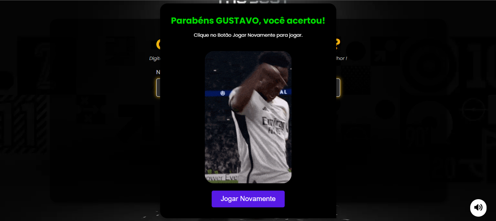

# GuessPlay: O Desafio de Adivinhação Temático do FIFA!

## Ícone do Projeto

<p align="center">
  
</p>

## Sobre o Projeto

GuessPlay é um jogo de adivinhação cativante e interativo **totalmente focado no universo do futebol, com uma forte inspiração nos times e estrelas do FIFA!** Você testará suas habilidades e conhecimentos contra um adversário de Inteligência Artificial: "O Robô". Mergulhe em uma experiência divertida onde você tenta adivinhar um número secreto e o Robô tenta adivinhar o seu, tudo isso ambientado com elementos visuais de clubes como **Barcelona, Real Madrid e Manchester City**, celebrando jogadores como Lamine Yamal, Vinicius Jr. e Phil Foden. Com diferentes níveis de dificuldade e feedback visual animado, GuessPlay promete horas de entretenimento desafiador para fãs de futebol e jogos!

## Screenshots

Aqui estão algumas imagens do jogo para você ter uma ideia da experiência:

**Tela de Escolha de Tema (com times do FIFA)**

<p align="center">
  
</p>

**Tela de Escolha de Dificuldade**

<p align="center">
  
</p>

**Tela de Jogo (Gameplay com tema FIFA)**

<p align="center">
  
</p>

**Tela de Vitória (comemorando como no campo!)**

<p align="center">
  
</p>

**Tela de Derrota (aquela sensação pós-jogo...)**

<p align="center">
  
</p>

## Tecnologias Utilizadas

Este projeto foi desenvolvido com uma abordagem "Vanilla", focando na pureza das tecnologias web fundamentais:

- **HTML5**: A base estrutural de todas as telas e elementos do jogo, garantindo a organização do conteúdo.
- **CSS3**: Responsável por toda a estilização, layout responsivo e o design visual atraente da aplicação, incluindo os estilos temáticos dos times de futebol.
- **JavaScript (ES6+) Puro**: O coração da lógica do jogo, implementado sem o auxílio de frameworks ou bibliotecas externas. Isso inclui:
  - **Importação de Módulos**: O código JavaScript é modularizado para melhor organização, manutenibilidade e reusabilidade.
  - **Gerenciamento de Estado com `localStorage`**: Utiliza o armazenamento local do navegador para salvar preferências do usuário (como o tema escolhido) e o nome do jogador, garantindo uma experiência contínua.
  - **Lógica de Inteligência Artificial (IA)**: Implementação do "Robô" que joga contra o usuário, com comportamentos distintos para cada nível de dificuldade.
  - **Manipulação do DOM**: Interage diretamente com os elementos HTML para criar, atualizar e remover a interface do usuário dinamicamente.

## Funcionalidades e Características Principais

- **Jogo de Adivinhação Interativo**: Desafie-se a adivinhar o número secreto e veja o Robô fazer o mesmo.
- **Temática FIFA Aprofundada**: Escolha entre temas de grandes clubes como **Barcelona, Real Madrid e Manchester City**, com elementos visuais de suas estrelas para personalizar a experiência de jogo.
- **Dificuldade Dinâmica**: Escolha um dos três níveis de dificuldade, que alteram o comportamento da IA do Robô:
  - **Fácil**: "Neste modo, o robô chuta um número aleatório entre 1 e 50."
  - **Médio**: "Neste modo, o robô chuta um número entre o seu chute e 50. Exemplo: se você chutar 20, o robô escolherá um número entre 20 e 50."
  - **Difícil**: "Neste modo, o robô chuta o número que estiver exatamente no meio entre o seu chute e 50. Exemplo: se você chutar 20, o robô chutará 35 (a média entre 20 e 50)."
- **Feedback Visual Imersivo**: Gifs animados de vitória e derrota, junto com efeitos sonoros, proporcionam uma experiência altamente interativa e divertida ao usuário, simulando a emoção de uma partida de futebol.
- **Persistência de Dados**: Salva o tema e o nome do usuário para sessões futuras, melhorando a usabilidade e a continuidade do jogo.

## Estrutura do Projeto

O projeto segue uma estrutura de arquivos lógica e organizada:

GuessPlay/
├── .vscode/ # Configurações específicas do Visual Studio Code
├── assets/ # Contém todos os recursos de mídia (áudios, ícones, imagens de tema, GIFs)
│ ├── audio/ # Arquivos de áudio do jogo
│ ├── guess-play/ # Recursos específicos do tema 'GuessPlay' (ex: favicon)
│ │ └── favicon.ico
│ ├── icon/ # Vários ícones usados no jogo
│ ├── imagem-theme/ # Imagens relacionadas aos temas dos times (Barcelona, Real Madrid, City)
│ └── screenshots/ # Pasta para suas screenshots/GIFs (crie se não existir!)
├── css/ # Todas as folhas de estilo CSS para estilizar a aplicação
│ ├── difficulty.css # Estilos para a tela de seleção de dificuldade
│ ├── global.css # Estilos globais aplicados em toda a aplicação
│ ├── inicial.css # Estilos para a tela inicial/de carregamento
│ ├── jogar.css # Estilos para a tela principal de jogo
│ └── welcome-screen.css # Estilos para a tela de boas-vindas ao usuário
├── js/ # Todos os arquivos JavaScript
│ ├── main.js # O ponto de entrada principal da aplicação JavaScript
│ ├── screens.js # Módulo centralizado para gerenciar diferentes telas do jogo
│ ├── pages/ # Módulos para telas/páginas individuais do jogo
│ │ ├── difficulty-screen.js # Lógica para a tela de dificuldade
│ │ ├── play-screen.js # Lógica para a tela principal de jogo
│ │ ├── theme-screen.js # Lógica para a tela de seleção de tema
│ │ └── welcome-user.js # Lógica para a tela de boas-vindas ao usuário
│ └── utils/ # Funções utilitárias
│ ├── local-storage.js # Funções para interagir com o armazenamento local do navegador
│ ├── navigateTo.js # Funções para lidar com a navegação entre telas
│ └── utils.js # Funções utilitárias gerais
└── index.html # O arquivo HTML principal da aplicação

## Como Executar Localmente

Para colocar o GuessPlay em funcionamento em sua máquina local, siga estes passos simples:

1.  **Clone o repositório:**
    ```bash
    git clone [https://github.com/seu-usuario/GuessPlay.git](https://github.com/seu-usuario/GuessPlay.git)
    ```
    (Substitua `seu-usuario` pelo seu nome de usuário real do GitHub.)
2.  **Navegue até o diretório do projeto:**
    ```bash
    cd GuessPlay
    ```
3.  **Abra o `index.html`:**
    Simplesmente abra o arquivo `index.html` em seu navegador web preferido. Você pode geralmente fazer isso clicando duas vezes no arquivo ou arrastando-o para a janela do navegador.

## Como Jogar

O processo para começar a jogar é simples e intuitivo:

1.  **Selecione o Time/Tema**: Ao iniciar o jogo, você terá a opção de escolher seu time de futebol favorito (Barcelona, Real Madrid ou Manchester City), que definirá a temática visual do jogo.
2.  **Escolha a Dificuldade**: Em seguida, decida seu nível de desafio contra o Robô: Fácil, Médio ou Difícil.
3.  **Informe seu Nome**: Digite seu nome de jogador para personalizar a experiência.
4.  **Boa Sorte Jogando contra o Robô!**: Comece a adivinhar o número secreto e prepare-se para a emocionante disputa contra a IA.

## Contribuindo

Contribuições são bem-vindas! Se você quiser contribuir para o projeto GuessPlay, por favor, siga estas diretrizes:

1.  Faça um fork do repositório.
2.  Crie uma nova branch (`git checkout -b feature/sua-nova-feature`).
3.  Faça suas alterações.
4.  Commit suas alterações (`git commit -m 'Adicionar nova feature'`).
5.  Envie para a branch (`git push origin feature/sua-nova-feature`).
6.  Abra um Pull Request detalhando suas alterações.

## Licença

Este projeto é de código aberto e está disponível sob a [Licença MIT](https://opensource.org/licenses/MIT).
